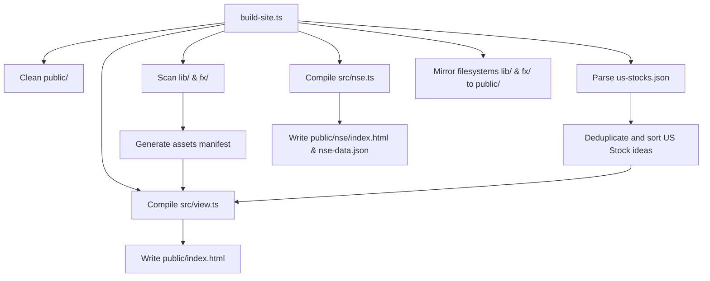

# Architecture Document - Moe Capital Unified Site

## 1. Tech Stack

- **Development Runtime**: [Bun](https://bun.sh)
- **Language**: TypeScript
- **Compilation Engine**: Pure-function Layout Compiler (`src/view.ts` and `src/nse.ts`)
- **Hosting & Edge Delivery**: [Cloudflare Pages](https://pages.cloudflare.com/) (100% static origin served over CDN edge)
- **Quality Assurance**: Bun Test & Playwright headless browser E2E test suites

## 2. Directory Structure

```text
/
├── public/           # Unified build outputs directory (mirrored to edge CDN)
│   ├── index.html    # Core dashboard (Alice Schroeder, Compilations, US Watchlists)
│   ├── nse/
│   │   ├── index.html # Monospace NSE Bloomberg-style financial terminal subpage
│   │   └── nse-data.json # Mirror of the corporate financials database
│   ├── lib/          # Discoverable investing books
│   └── fx/           # Trading strategy reports
├── src/
│   ├── assets.ts     # Directory asset manifest discovery
│   ├── content.ts    # Main watchlists metadata & static site structure
│   ├── nse.ts        # Pure static NSE compiler & layout template engine
│   ├── us-stocks.ts  # Compile-time Telegram aggregator & de-duplicator
│   └── view.ts       # HTML dynamic layout compiler for the dashboard
├── scripts/
│   └── build-site.ts # Main SSG pipeline compiler orchestrator
├── data/
│   └── nse-data.json # Core corporate financials database
└── tests/            # Automated integration & verification tests
```

## 3. Build & Compile Pipeline

Running `bun run build` starts our unified multi-tier compilation pipeline:



1. **FileSystem Scan**: `src/assets.ts` scans physical files in `lib/` and `fx/` to dynamically verify asset links.
2. **Aggregation**: `src/us-stocks.ts` de-duplicates 1,382 Telegram stock messages, alphabetical-sorts them, and structures them.
3. **Dashboard Compilation**: `src/view.ts` compiles the main dashboard page using pure template functions.
4. **NSE Terminal Compilation**: `src/nse.ts` reads `/data/nse-data.json`, copies it as a static asset, compiles the Bloomberg-style workspace grid, and generates `public/nse/index.html`.

---

## 4. Runtime Architecture

The site runs with **zero runtime JavaScript frameworks** on the client, utilizing high-performance native browser mechanics:

### US Stocks filtering
- All 1,191 tickers are pre-rendered inside native HTML5 `<details>` lazy accordions.
- Instantaneous search is achieved via simple inline EventListeners that match query inputs to the accordion's `data-ticker` or `data-company` attributes, toggling `style.display = 'none'` at 60fps.

### NSE terminal Workspace
- **Async Caching & Fallback**: DOMContentLoaded fires a background progressive fallback fetch. It tries host-relative `/nse/nse-data.json` first, and falls back to relative `nse-data.json` if run locally or inside nested subfolders.
- **Bloomberg Pane Update**: Card clicks call the `selectStock(ticker)` function. It queries the local in-memory database cache, computes metrics, and formats tables using clean template strings in <1ms.
- **Live Sync**: A background CORS-proxied fetch retrieves live quotes from `afx.kwayisi.org` using high-speed, escaped regular expressions (`rowRegex`), merging updates onto local variables in real-time.
- **Type Safety**: All metrics formatting runs through type-guarded converters (`parseFloat`, `!isNaN`) to prevent unhandled TypeErrors and freeze-ups on incomplete data sets.

---

## 5. Design Aesthetic

Following an elegant **Monospace Brutalist & Anemone Zola** visual direction:
- **Color Palettes**: Sleek dark mode HSL configurations with HSL-balanced highlight states. Automatically reverts to light mode via `@media (prefers-color-scheme: light)`.
- **Typography**: Complete monospace layout (`JetBrains Mono`, `IBM Plex Mono`) to emphasize deep research and technical precision.
- **Micro-animations**: Smooth hover translations on accordions and borders.

---

## 6. End-to-End Test & Verification Gates

Quality is enforced through a strict double-layered verification system:
1. **Core Unit/Integration Tests (`tests/`)**: Executed via Bun Test to assert database integrity, SSG compilers outputs, and parsing deduplications.
2. **Headless Browser E2E Tests (`scratch/playwright_test.ts`)**: Boots a clean, local file server using `Bun.serve` on a clean port, launches a headless Playwright Chromium instance, navigates to `/nse`, clicks target stock cards, and asserts that the right-pane workspace, balance sheets, and key ratios tables render perfectly with zero browser exceptions or syntax warnings.

---

## 7. Architectural Decision Record (ADR) Log

### ADR-001: Pure Static Multi-Page Compilation over Edge Serverless
- **Status**: Accepted
- **Context**: Dynamic serverless workers and edge proxies introduced latency, cold starts, and complex deployments for financial datasets.
- **Decision**: Compile all pages (root dashboard and `/nse` terminal) ahead-of-time into flat HTML/JSON served directly from Cloudflare Pages CDN edge.
- **Consequences**: Zero server runtime costs, sub-10ms page delivery, 100% data coverage offline.

### ADR-002: Suspension of Arbitrary File-Length Thresholds for Cohesive Data
- **Status**: Accepted
- **Context**: Enforcing strict `<500 LOC` rules fractured large immutable datasets (such as 6-part full text investor interviews in `src/content.ts` and terminal template logic in `src/nse.ts`) into multiple artificial micro-files.
- **Decision**: Explicitly suspend the `<500 LOC` constraint across the codebase, prioritizing Rich Hickey principles of high cohesion, data locality, and value immutability.
- **Consequences**: Unbroken content integrity, atomic diffs, instant full-text searchability, and reduced complection.

### ADR-003: Babashka (`bb.edn`) Task Orchestration & Zero-NPM Policy
- **Status**: Accepted
- **Context**: Build scripts relied on varied npm or shell scripts with platform quirks.
- **Decision**: Adopt Babashka (`bb.edn`) as the unified task runner for `clean`, `test`, `build`, and `deploy`, coupled with Bun for JS/TS execution (`bun`, `bunx`), eliminating `npm` and `python` dependencies.
- **Consequences**: High-speed task startup (<10ms), declarative dependency graphs, cross-platform portability.

### ADR-004: Hermetic Sandbox-Safe Test Fixtures
- **Status**: Accepted
- **Context**: Tests previously had hardcoded machine directory strings (`/Users/moe/Desktop/moecapital`) and wrote to `/tmp`, triggering sandbox permission errors.
- **Decision**: Refactor all test suites to resolve paths dynamically via `process.cwd()` and `import.meta.dir`, isolating temporary files to local `tests/.tmp_stocks/` fixtures with automated teardown.
- **Consequences**: 100% green test pass rate in all development and sandboxed CI environments.
